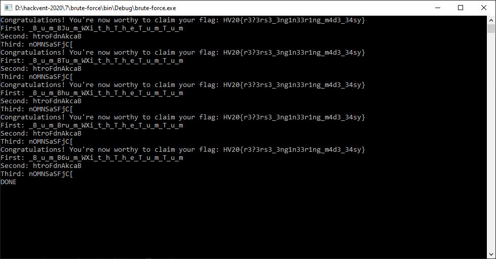

# HV20.07 Bad morals

For this challenge, we get a .NET binary. Our goal is to reverse engineer the program and find out the correct values for the 3 parameters. Once that is done, the binary should print out our flag.

Thankfully, it was an easy task to decompile the binary using JetBrains [dotPeek](https://www.jetbrains.com/de-de/decompiler/). This way, I was able to look at the [source code](./decompiled/cc1b4db7-d5b6-48b8-bee5-8dcba508bf81/Program.cs). Two of the three parameters were easily recoverable:

- Parameter 2: `htroFdnAkcaB` (reverse of `BackAndForth`)
- Parameter 3: `nOMNSaSFjC[` (can be recovered by reversing an XOR chain on `DinosAreLit`)

For the first parameter, it is a bit more tricky. We know that the characters with even indizes form the word `BumBumWithTheTumTum`. Most characters with odd indizes are ignored in the calculation of the flag. However, the hash code of the character at index 8, and the value of the character at index 14 are still used. As the output of this operation gets base64 decoded, there are only 64 possible values for each of the characters. Therefore, I wrote a simple [program](./brute-force/Program.cs) that brute forces all possibilities. In the end, it found 4 possible values for the first input and also recovered the flag:

**Flag:** HV20{r3?3rs3_3ng1n33r1ng_m4d3_34sy}

