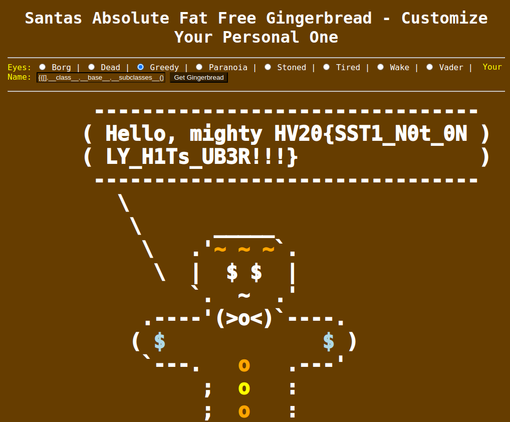

# HV20.09 Santa's Gingerbread Factory

For this challenge, we get presented with a simple website. The website consists of a single page with a form where we can select the eyes (radio buttons) and enter a name for our gingerbread. Once we submit the form, the server returns a page with an ASCII art gingerbread and a speech bubble containing our name.

Doing some basic information gathering and looking at the response headers of the server, we can see that it's implemented in python (`server: Werkzeug/1.0.1 Python/2.7.16` - even using an outdated and insecure python version). However, this instantly reminded me of a Flask / Jinja template injection attack. Using a payload like `{{7+7}}` we can confirm that this is actually the case as the expression gets evaluated on the server and the response contains the output of the evaluation (`14`). This means that we actually conducted a successful SSTI (server side template injection) attack.

Now we can just follow the standard template injection attack path to get a remote file inclusion (RCE is not really needed, as we already now the location of the flag). By accessing the `__subclasses__` array of the `object` class, we can get a reference to the `file` class. After trying a couple of payloads, we can see that the `file` class is the 40th subclass of `object`:

```
{{[].__class__.__base__.__subclasses__()[40] }}
Hello, mighty <type 'file'>
```

Now we can simply instantiate an object of the `file` class and read the contents of `/flag.txt` using the following payload: `{{[].__class__.__base__.__subclasses__().pop(40)('/flag.txt').read() }}`



**Flag:** HV20{SST1_N0t_0NLY_H1Ts_UB3R!!!}
