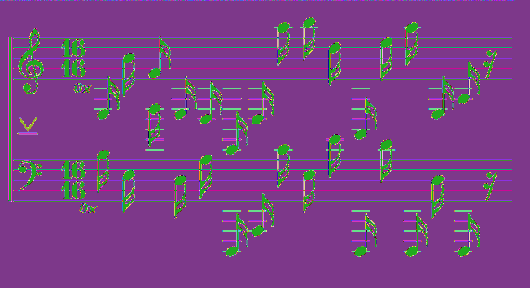

# HV20.11 Chris'mas carol

For this challenge, we get two images. The first one contains a set of music notes, whereas the second one shows the skyline of a city. As the challenge is labelled as steganography, I first decided to analyze the images using `Stegsolve`. For the image of the skyline, there were no interesting findings. However, the piano notes seem to hide some interesting stuff:

Firstly, the color channels contain some hidden `XOR` symbol. Most likely, we will need to read the notes and combine them using XOR. Moreover, there seems to be some additional information hidden in the image (could be LSB steganography), if we look at the top rows of the image:



I tried to extract the data using `steghide` and `stegsolve` but did not get any satisfying results. Therefore, I decided to focus on the decoding of the notes first. As I am not able to read them by myself, I found a very helpful [cheatsheet](https://upload.wikimedia.org/wikipedia/commons/6/67/Pianoforte_Klaviatur-wIKI_4.jpg) which allowed me to map the notes in each row to a sequence of hex characters (fortunately there was no `G`). After xoring this values, I ended up with a promising string:

```
E3 B4 F4 E3 D3 E2 D3 A5 B5 D5 A2 E5 A5 E3 A3
B3 E3 D5 D3 a3 D1 A1 C4 E3 E4 D1 D4 D1 D3 D1
P  W  !  0  p  3  r  a  V  1  s  1  t  0  r

PW!0p3raV1s1t0r
```

However, this is not our flag. Probably, we still need to extract the other piece of information that is hidden in the image with the piano notes. As I still had not used the image of the skyline, I did a reverse google search and learned that it most likely shows the skyline of Hongkong. To my surprise, there was another interesting search result, leading to an online image steganography tool: https://www.mobilefish.com/services/steganography/steganography.php

With the help of this tool, I was able to extract a password protected [zip file](./flag.zip) from the piano image. I tried to unzip it using the password we got from the piano notes and finally got a valid flag.

**Flag:** HV20{r3ad-th3-mus1c!}
