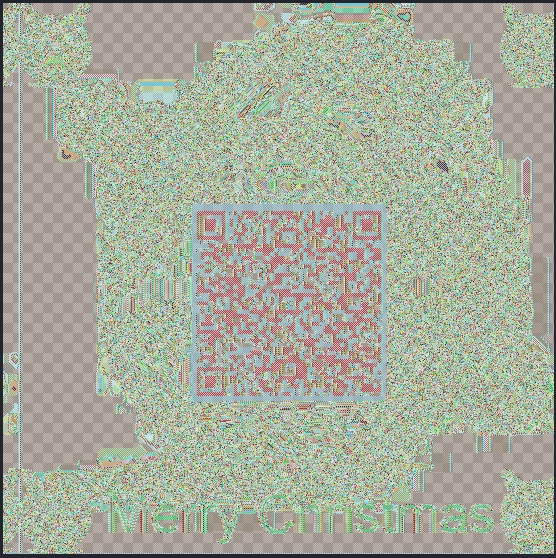
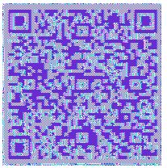

# HV20.13 Twelve steps of christmas

Today's challenge consists of an XLS file. The challenge description is giving us a sense that this might involve some old school file encryption and compression algorithms. The first thing which caught my attention is a obscure note in the column for the user Bread:

```
Not a loaf of bread which is mildly disappointing 1f 9d 8c 42 9a 38 41 24 01 80 41 83 8a 0e f2 39 78 42 80 c1 86 06 03 00 00 01 60 c0 41 62 87 0a 1e dc c8 71 23 Why was the loaf of bread upset? His plan were always going a rye. How does bread win over friends? “You can crust me.” Why does bread hate hot weather? It just feels too toasty.
```

Trying the usual tools to decode the hex bytes from this note did not give me any good results, so I continued to search for more hidden stuff in the XLS file. After a couple of rabbit holes (e.g. image files having trailing data), I discovered an interesting hex string in an [OLE](https://forensicswiki.xyz/wiki/index.php?title=OLE_Compound_File) file, which can be easily extracted using the following command: `oleobj ./5862be5b-7fa7-4ef4-b792-fa63b1e385b7.xls`.

I tried for a while to make sense out of these bytes, until I realized that maybe I need to proceed to the second part of the challenge description. I created a binary file from the bytes and checked the type:

```bash
➜  13 git:(main) ✗ file test-large.bin
test-large.bin: compress'd data 12 bits
```

As the data should be compressed using an 80s style algorithm, I tried to [LZW](https://en.wikipedia.org/wiki/Lempel%E2%80%93Ziv%E2%80%93Welch) decompress (`uncompress` command) it and it worked. This resulted in a file with the following type: `openssl enc'd data with salted password`

I did the same for the random bytes in Breads comment, and got some interesting output after decompressing. Apparently, the suspicious hex string in Breads comment contains a LZW compressed bitmap header:

```bash
➜  13 git:(main) ✗ file test1
test1: PC bitmap, Windows 98/2000 and newer format, 551 x 551 x 32
```

Based on that information, I realized that I probably need to combine both files to get a valid bitmap, which then contains our flag. Unfortunately, I have no clue what could be the decryption key. After various tries to use the strange hex values as decryption keys, I remembered that image encryption might lead to unexpected results when using a weak mode of operation like ECB (remember the infamous [ECB penguin](https://crypto.stackexchange.com/questions/14487/can-someone-explain-the-ecb-penguin)).

If that is true in our case, we might be able to get an idea about the content of the image by combining the bitmap header with the encrypted data. A quick experiment showed promising results:



Unfortunately, my QR code reader was not yet able to read the image. I tried to do some cropping and adjust the contrast using GIMP, but still was not able to receive the flag. After a while, I took a detailed look at the file format of the openssl encrypted image data and noticed it contained some leading bytes that for sure don't belong to the image:

```bash
➜  13 git:(main) ✗ head encrypted-file | xxd
00000000: 5361 6c74 6564 5f5f 5cea a7a1 221f 1438  Salted__\..."..8
00000010: 3077 9172 c85b 8583 d13e 829a e92f d502  0w.r.[...>.../..
00000020: 640f 42e3 5dad 366e ec19 7fc4 ffbd c276  d.B.].6n.......v
00000030: 6cdc 04d4 a42a 0abc 56b7 1f75 ac60 baab  l....*..V..u.`..
00000040: 56b7 1f75 ac60 baab 0d6b cb7b 9967 6792  V..u.`...k.{.gg.
00000050: 1b1b 290c 866d 1cd8 2475 5666 040a 99c8  ..)..m..$uVf....
00000060: 56b7 1f75 ac60 baab 56b7 1f75 ac60 baab  V..u.`..V..u.`..
00000070: 56b7 1f75 ac60 baab 56b7 1f75 ac60 baab  V..u.`..V..u.`..
00000080: 56b7 1f75 ac60 baab 6205 629c 96ba 8a9e  V..u.`..b.b.....
00000090: 56b7 1f75 ac60 baab 56b7 1f75 ac60 baab  V..u.`..V..u.`..
000000a0: 56b7 1f75 ac60 baab 56b7 1f75 ac60 baab  V..u.`..V..u.`..
```

I removed the first 8 bytes (`Salted__`) and generated a new bitmap. This time, the contrast seemed better and after fiddling around for another few minutes I was finally able to scan the image and obtain the flag:



**Flag:** HV20{U>watchout,U>!X,U>!ECB,Im_telln_U_Y.HV2020_is_comin_2_town}
