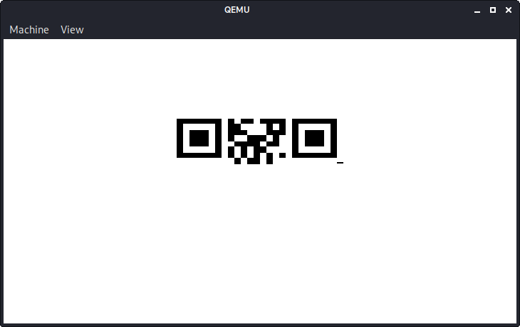
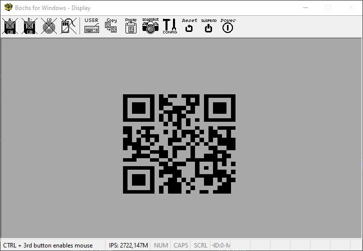

# HV20.14 Santa's Special GIFt

For this challenge, we get an GIF image of a file (the tool). As the challenge is labelled with forensic and reverse engineering, we can assume that some binary must be hidden inside the GIF. To my surprise, the file is quite small (512 byte) and the usual image forensic tools did not yield any exciting results. However, there were still a couple of things that caught my attention:

Firstly, the image's EXIF comment contains a bunch of weird (non printable) bytes. Moreover, there is some trailing data after the end of the actual image (`0000 55aa`). Furthermore, there is another string in the file that caught my attention: `uvag:--xrrc-tbvat`. After playing around with various decodings I realized that this is just a rot13 encoded hint: `hint:--keep-going`. This looks like a command line option from the popular build tool [make](https://www.gnu.org/software/make/manual/html_node/Errors.html#Errors), which confirms my first impression that the GIF probably contains binary data.

After a bunch of random experiments, I realized that the image might actually be a valid MBR, as it has a valid size (512 byte) and a proper signature (ends with `0000 55aa`). I tried to boot the image as a floppy drive using `qemu-system-i386` and it seemed to work:

```bash
➜  14 git:(main) ✗ qemu-system-i386 -fda 5625d5bc-ea69-433d-8b5e-5a39f4ce5b7c.gif
```

However, the output screen only contained a partial QR code:



I tried to do the same in Bochs to make sure it was not just a QEMU problem, but unfortunately I still got the same result. It seems like the source code of the MBR has a bug and prematurely stops printing the QR code. The probably easiest solution in this case is trying to reverse engineer and patch the MBR. Thankfully, IDA already has a handy integration for Bochs, so I could simply import my [bochs configuration](./bochssrc.cfg) and analyze the assembly in IDA.

After digging through the disassembly for a couple of minutes, I discovered a strange exit condition in a loop that looked like it might print parts of the QR code. At `7C5B`, the code compares a counter with `E0` (224 in decimal) and aborts in case this value is reached. If we assume that our QR code consists of 512 byte, this would mean that the loop aborts before it completes the first half, which would fit with our observations from debugging the image in QEMU.

```assembly
BOOT_SECTOR:7C57 start_of_loop:                          ; CODE XREF: BOOT_SECTOR:7C94↓j
BOOT_SECTOR:7C57                 test    di, di
BOOT_SECTOR:7C59                 jnz     short loc_7C79
BOOT_SECTOR:7C5B                 cmp     si, 0E0h
BOOT_SECTOR:7C5F                 jnz     short loc_7C63
BOOT_SECTOR:7C61                 cli
BOOT_SECTOR:7C62                 hlt
BOOT_SECTOR:7C63 ; ---------------------------------------------------------------------------
BOOT_SECTOR:7C63
BOOT_SECTOR:7C63 loc_7C63:                               ; CODE XREF: BOOT_SECTOR:7C5F↑j
BOOT_SECTOR:7C63                 mov     ax, 3597
BOOT_SECTOR:7C66                 int     10h             ; - VIDEO - WRITE CHARACTER AND ADVANCE CURSOR (TTY WRITE)
BOOT_SECTOR:7C66                                         ; AL = character, BH = display page (alpha modes)
BOOT_SECTOR:7C66                                         ; BL = foreground color (graphics modes)
BOOT_SECTOR:7C68                 mov     al, 0Ah
BOOT_SECTOR:7C6A                 int     10h             ; - VIDEO -
BOOT_SECTOR:7C6C                 mov     cx, 1Bh
BOOT_SECTOR:7C6F
BOOT_SECTOR:7C6F loc_7C6F:                               ; CODE XREF: BOOT_SECTOR:7C74↓j
BOOT_SECTOR:7C6F                 mov     al, 20h ; ' '
BOOT_SECTOR:7C71                 int     10h             ; - VIDEO -
BOOT_SECTOR:7C73                 dec     cx
BOOT_SECTOR:7C74                 jnz     short loc_7C6F
BOOT_SECTOR:7C76                 mov     di, 19h
BOOT_SECTOR:7C79
BOOT_SECTOR:7C79 loc_7C79:                               ; CODE XREF: BOOT_SECTOR:7C59↑j
BOOT_SECTOR:7C79                 mov     cx, si
BOOT_SECTOR:7C7B                 and     cx, dx
BOOT_SECTOR:7C7D                 add     cx, cx
BOOT_SECTOR:7C7F                 mov     bx, si
BOOT_SECTOR:7C81                 shr     bx, 2
BOOT_SECTOR:7C84                 mov     bp, [bx+7C9Eh]
BOOT_SECTOR:7C88                 shr     bp, cl
BOOT_SECTOR:7C8A                 and     bp, dx
BOOT_SECTOR:7C8C                 mov     al, [bp+7CF0h]
BOOT_SECTOR:7C90                 int     10h             ; - VIDEO -
BOOT_SECTOR:7C92                 dec     di
BOOT_SECTOR:7C93                 dec     si
BOOT_SECTOR:7C94                 jnz     short start_of_loop
BOOT_SECTOR:7C96                 mov     ah, 1
```

Based on this observation, I decided that it is worth a shot to patch the check and increase the value from 224 to 512 (see [patched.img](./patched.img)). Afterwards I tried to boot the patched image and indeed ended up with a valid QR code:



Of course, the patched image is also still a valid GIF:


**Flag:** HV20{54n74'5-m461c-b00t-l04d3r}

# HV20.H2 Oh, another secret!

Who knows where this could be hidden... Only the best of the best shall find it!

Along with this challenge, another hidden flag got released. Special kudos to the Author for hiding a MBR, a QR and a hidden flag inside a single GIF with 512 bytes. To find the hidden flag, I had to go through the disassembly once more. After a while, another loop caught my attention:

```assembly
BOOT_SECTOR:7C23                 xor     bx, bx
BOOT_SECTOR:7C25                 mov     ah, 0Eh
BOOT_SECTOR:7C27
BOOT_SECTOR:7C27 loc_7C27:                               ; CODE XREF: BOOT_SECTOR:7C38↓j
BOOT_SECTOR:7C27                 mov     al, [bx+7CF4h]
BOOT_SECTOR:7C2B                 mov     cl, [bx+7C9Eh]
BOOT_SECTOR:7C2F                 test    al, al
BOOT_SECTOR:7C31                 jz      short loc_7C3A
BOOT_SECTOR:7C33                 xor     al, cl
BOOT_SECTOR:7C35                 int     10h             ; - VIDEO - WRITE CHARACTER AND ADVANCE CURSOR (TTY WRITE)
BOOT_SECTOR:7C35                                         ; AL = character, BH = display page (alpha modes)
BOOT_SECTOR:7C35                                         ; BL = foreground color (graphics modes)
BOOT_SECTOR:7C37                 inc     bx
BOOT_SECTOR:7C38                 jmp     short loc_7C27
```

Before entering the loop `bx` is set to 0. Then the loop XORs a sequence of bytes starting from `7CF4` and `7C9E` respectively. Although it looks like the program prints the values to the screen, they don't seem to be part of the QR code, as this is printed in another loop below this one. To find out how the result of this operation actually looks like, I wrote a small [python program](./hidden-flag.py) which reads the byte sequences from the image file and XORs them. This resulted in the second hidden flag.

**Flag:** HV20{h1dd3n-1n-pl41n-516h7}
