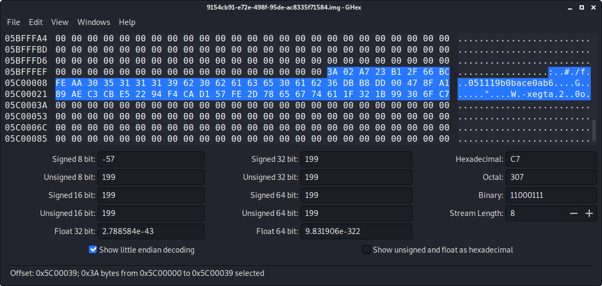

# HV20.18 Santa's lost home

For this challenge, we get Santas compressend and ecrypt-encrpyted home partition. Our goal is to restore his data and get the flag. However, the backup is somehow corrupted and we only know that the password should contain Santas name.

As I am not very familiar with [eCryptfs](https://www.ecryptfs.org/) and potential techniques to recover the keys for it, I did some research first and found and interesting article that describes how this could be done: https://research.kudelskisecurity.com/2015/08/25/how-to-crack-ubuntu-disk-encryption-and-passwords/

I decided to just try my luck and followed the instructions from the article. To do this, we have to get acess to the `wrapped-passphrase` file, which contains some sort of password hash and fault, so the decrypting program can verify if the user specified password was correct. However, on our image I was not able to find this file. Probably this is the important file that went missing before Santa did the backup. Unfortunately, it seems like the `wrapped-passphrase` file is a hard-requirement when performing this attack, so I decided to dig a little bit deeper.

From the article I learned that the magic bytes for this type of file are `\x3a\x02`, so I used `binwalk` to search for them in the image. This gave me three findings, which I later on manually checked in an hexeditor to see if they actually could be the `wrapped-passphrase` file:

```bash
➜  18 git:(main) ✗ binwalk -R="\x3a\x02" 9154cb91-e72e-498f-95de-ac8335f71584.img

DECIMAL       HEXADECIMAL     DESCRIPTION
--------------------------------------------------------------------------------
77824         0x13000         Raw signature (\x3a\x02)
7527715       0x72DD23        Raw signature (\x3a\x02)
96468992      0x5C00000       Raw signature (\x3a\x02)
```

This way I was able to recover the actual content of the `wrapped-passphrase` file from the last finding (`0x5C00000`):



Using the following `dd` command I finally extracted the file from the file:

```bash
➜ 18 git:(main) ✗ dd if=./9154cb91-e72e-498f-95de-ac8335f71584.img of=wrapped-passphrase bs=1 count=58 skip=96468992
58+0 records in
58+0 records out
58 bytes copied, 0.000816455 s, 71.0 kB/s
➜ 18 git:(main) ✗ xxd wrapped-passphrase
00000000: 3a02 a723 b12f 66bc feaa 3035 3131 3139 :..#./f...051119
00000010: 6230 6261 6365 3061 6236 dbb8 dd00 478f b0bace0ab6....G.
00000020: a189 aec3 cbe5 2294 f4ca d157 fe2d 7865 ......"....W.-xe
00000030: 6774 611f 321b 9930 6fc7 gta.2..0o.
```

My next step was trying to crack this password using the _John the Ripper_ tool. Firstly, we have to convert the `wrapped-passphrase` file to a valid [PASSWD file](./hash.passwd) for _John_, wich can be done using the following command:

```bash
➜  18 git:(main) ✗ /usr/share/john/ecryptfs2john.py ./wrapped-passphrase > hash.passwd
```

Now we can simply import the file in _John_ and start cracking the password. As the time during hackvent is quite limited and cracking the password is an expensive operation, we got a couple of hints to speed up the process. Firstly, we know that the password has to contain Santas name. Moreover, we can guess from the hints that it is not in the popuplar `rockyou.txt` wordlist, but in the [Human Passwords Only](https://crackstation.net/files/crackstation-human-only.txt.gz) list of _CrackStation_. I downloaded the password list and filtered out all entries that contain the string `santa`. With this wordlist, I was able to crack the hash and obtain the mount password in a couple of seconds: `think-santa-lives-at-north-pole`

Using this password, I was able to decrypt and mount the volume on my machine (turned out this is not just a 3 minute task). Finally, I was able to find the flag in the home directory of santa:

**Flag:** HV20{a_b4ckup_of_1mp0rt4nt_f1l35_15_3553nt14l}
