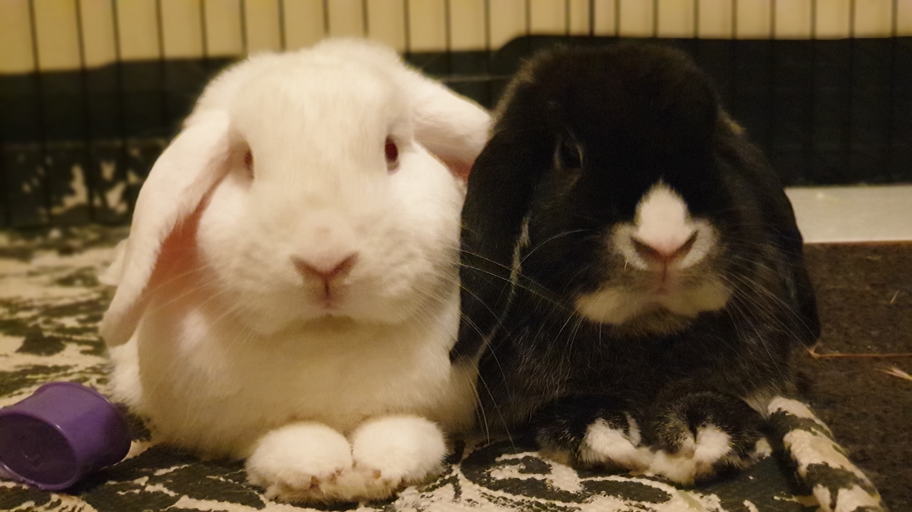

# HV20.20 Twelve steps of Christmas

For this challenge, we get a huge PNG file with a lot of bunnies. As it is a steganography challenge, I tried the usual tools (`strings`, `binwalk`, `exiftool`) to analyze the file. The first thing that caught my attention was that the exifdata of the file seems to contain an embedded _HTML_ document. I tried to extract the _HTML_ (see [embedded.html](./embedded.html)) and open it in my browser, but the JavaScript throws some errors. However, this allowed me to take a closer look at the code.

It seems like the page registers a onclick handler on the image, parses some additional data embedded in the document and creates a python file out of it. This whole logic is only triggered if we specify the correct query parameter. The parameter is verified via its _SHA1_ hash (needs to equal to `60DB15C4E452C71C5670119E7889351242A83505`). Fortunately, this is a non-salted hash which can be easily looked up on crackstation and corresponds to the input `bunnyrabbitsrule4real`. Moreover, I figured out that the script was failing because I removed required data when extracting the _HTML_. To solve this stage, it is sufficient to rename the PNG file to `.html`, start a local webserver and access it in your browser by specifying the query parameter `p=bunnyrabbitsrule4real`. After clicking on the image, the browser downloads a [python file](./11.py) which is required for the second stage.

After taking a look at the python file, we can see that it takes two parameters. The first one is a filename (presumably the name of our image), while the second one is a string which tells the program on where to split the input file. After splitting the input file, the last chunk gets XORed using a static key and saved as a `7z` file. This means, we probably have an encrypted _7zip_ archive embedded within the initial image. To find out where to split the input, we just need to XOR the start of the key `Rabbits are small ...` with the magic bytes of the 7zip file (`ord('7'), ord('z'), 0xBC, 0xAF, 0x27, 0x1C`). I wrote a small [python program](./find-bytes.py) to do this and found out that the split key is `breadbread`. Later on, I also discovered that we could have found this key by running the text which was provided as a hint. Apparently, it is a program written in the esoteric [Chef](https://esolangs.org/wiki/Chef) programming language. After running `11.py` with the correct parameters (`python3 11.py bfd96926-dd11-4e07-a05a-f6b807570b5a.png breadbread`), I was able to get the required [archive](./7zip/11.7z).

I started to extract the archive and found out that it contained the layers of a docker image. I extracted all the layers and stepped through the files until I found something interesting. The important part seems to happen in layers `ab2b751e14409f169383b5802e61764fb4114839874ff342586ffa4f968de0c1`. In the home folder of bread we discover a lot of files containing hex strings. From the commands found in json file which reassembles the initial `Dockerfile`, we can see how these files were generated and learn that they contain the data for a JPEG image:

```json
{
  "architecture": "amd64",
  "config": {
    "User": "bread",
    "Env": [
      "PATH=/usr/local/sbin:/usr/local/bin:/usr/sbin:/usr/bin:/sbin:/bin"
    ],
    "Cmd": ["/bin/sh", "-c", "tail -f /dev/null"],
    "WorkingDir": "/home/bread/",
    "ArgsEscaped": true,
    "OnBuild": null
  },
  "created": "2020-12-08T14:41:59.119577934+11:00",
  "history": [
    {
      "created": "2020-10-22T02:19:24.33416307Z",
      "created_by": "/bin/sh -c #(nop) ADD file:f17f65714f703db9012f00e5ec98d0b2541ff6147c2633f7ab9ba659d0c507f4 in / "
    },
    {
      "created": "2020-10-22T02:19:24.499382102Z",
      "created_by": "/bin/sh -c #(nop)  CMD [\"/bin/sh\"]",
      "empty_layer": true
    },
    {
      "created": "2020-12-08T14:41:33.015297112+11:00",
      "created_by": "RUN /bin/sh -c apk update \u0026\u0026 apk add  --update-cache --repository http://dl-3.alpinelinux.org/alpine/edge/testing/ --allow-untrusted steghide xxd # buildkit",
      "comment": "buildkit.dockerfile.v0"
    },
    {
      "created": "2020-12-08T14:41:33.4777984+11:00",
      "created_by": "RUN /bin/sh -c adduser --disabled-password --gecos '' bread # buildkit",
      "comment": "buildkit.dockerfile.v0"
    },
    {
      "created": "2020-12-08T14:41:33.487504964+11:00",
      "created_by": "WORKDIR /home/bread/",
      "comment": "buildkit.dockerfile.v0"
    },
    {
      "created": "2020-12-08T14:41:59.119577934+11:00",
      "created_by": "RUN /bin/sh -c cp /tmp/t/bunnies12.jpg bunnies12.jpg \u0026\u0026 steghide embed -e loki97 ofb -z 9 -p \"bunnies12.jpg\\\\\\\" -ef /tmp/t/hidden.png -p \\\\\\\"SecretPassword\" -N -cf \"bunnies12.jpg\" -ef \"/tmp/t/hidden.png\" \u0026\u0026 mkdir /home/bread/flimflam \u0026\u0026 xxd -p bunnies12.jpg \u003e flimflam/snoot.hex \u0026\u0026 rm -rf bunnies12.jpg \u0026\u0026 split -l 400 /home/bread/flimflam/snoot.hex /home/bread/flimflam/flom \u0026\u0026 rm -rf /home/bread/flimflam/snoot.hex \u0026\u0026 chmod 0000 /home/bread/flimflam \u0026\u0026 apk del steghide xxd # buildkit",
      "comment": "buildkit.dockerfile.v0"
    },
    {
      "created": "2020-12-08T14:41:59.119577934+11:00",
      "created_by": "USER bread",
      "comment": "buildkit.dockerfile.v0",
      "empty_layer": true
    },
    {
      "created": "2020-12-08T14:41:59.119577934+11:00",
      "created_by": "CMD [\"/bin/sh\" \"-c\" \"tail -f /dev/null\"]",
      "comment": "buildkit.dockerfile.v0",
      "empty_layer": true
    }
  ],
  "os": "linux",
  "rootfs": {
    "type": "layers",
    "diff_ids": [
      "sha256:ace0eda3e3be35a979cec764a3321b4c7d0b9e4bb3094d20d3ff6782961a8d54",
      "sha256:f9a8379022de9f439ace90e2104d99b33559d08c2e21255914d27fdc0051e0af",
      "sha256:1c50319140b222d353c0d165923ddc72c017da86dc8f56fa77826c53eba9c20d",
      "sha256:5f70bf18a086007016e948b04aed3b82103a36bea41755b6cddfaf10ace3c6ef",
      "sha256:56553910173dbbe9836893f8e0a081a58208ad47385b66fbefad69caa5e687e1"
    ]
  }
}
```

Using some simple shell commands, we can recreate the JPEG and get the following image (called `bunnies12.jpg` in breads container):

```bash
➜  flimflam git:(main) ✗ cat flom* > combined.txt
➜  flimflam git:(main) ✗ xxd -r -p combined.txt test.jpg
➜  flimflam git:(main) ✗ file test.jpg
test.jpg: JPEG image data, JFIF standard 1.01, aspect ratio, density 1x1, segment length 16, baseline, precision 8, 4032x2268, components 3
```



Moreover, we can see from the docker image that this file contains another hidden image which was embedded using `steghide`. Thankfully, the run command also shows the `steghide` password, so I was able to extract the hidden PNG file using the following command:

```bash
➜  20 git:(main) ✗ steghide extract -p "bunnies12.jpg\\\" -ef /tmp/t/hidden.png -p \\\"SecretPassword" -sf bunnies12.jpg -xf hidden.png
wrote extracted data to "hidden.png".
➜  20 git:(main) ✗ file hidden.png
hidden.png: PNG image data, 185 x 185, 8-bit gray+alpha, non-interlaced
```


Still, the image does not look like it would directly give us the flag. As there were no other hints on where to start, I tried my luck and imported it in `stegsolve`. Apparently, there was some sort of color inversion because stegsolve immediately displayed me a valid QR code. Scanning the code finally revealed the flag for this challenge:


**Flag:** HV20{My*pr3c10u5_my_r363x!!!,\_7hr0w_17_1n70_7h3_X1.*-\_64l4dr13l}
