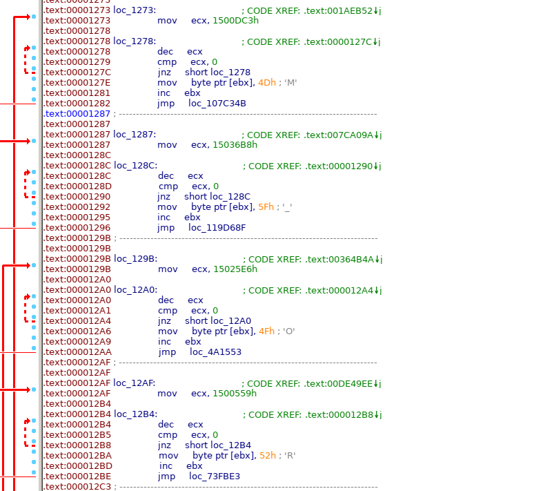

# HV20.22 Padawanlock

For this challenge, we get a 32 bit ELF file. The elf file asks us for a 6 digit PIN. If we enter the correct pin, it would return us the flag. When guessing a PIN, we can notice that each PIN (even the wrong ones), lead to a different output:

```bash
➜  22 git:(main) ✗ ./padawanlock
PIN (6 digits): 111111
Unlocked secret is: }%
➜  22 git:(main) ✗ ./padawanlock
PIN (6 digits): 123456
Unlocked secret is: _IMPERIAL_CRUISER.)}%
```

However, using `strings` we can verify that none of those strings (and of course also not our flag) is directly embedded into the binary. Instead, they are built dynamically based on the provided PIN. Time to do some actual reverse engineering!

I opened the application in IDA and noticed that the overall structure is rather simple. The main function simply gets the data from stdin, converts it to an integer (`atoi`) and calculates a value based on the input. Afterwards, the function directly jumps to the calculated value. The major part of the binary is structured in a special way (see screenshot). We have many chunks that look almost completely the same. First, there is a useless loop over `ecx`, which is probably just there to add some delay and make brute forcing harder (otherwise, it would be easily possible to brute-force the 6 digits within 24 hours). Afterwards, a single character gets added at `ebx`. Finally, there is a hardcoded `jmp` instruction to another of these blocks.



When we provide a PIN, the binary calculates an address which is somewhere in this weird jump-print struture. Once we have found the entry point, all other steps are static since the `jmp` instructions are hardcoded. In our case, we can exploit this behavior and improve the brute-force speed by finding entrypoints which would have the letter `H` as the first character. To do this, we first have to understand how exactly the program calculates the location of the first `jmp` instruction: This can be summarized in the following way:

The base address of the jump table is at `0x124B`. To calculate the address for the first `jmp`, the app adds `(20 * PIN)` to this value. Moreover, we can see that there are exactly 13 byte between the target of the `jmp`, and the instruction which adds the next character to the output string (e.g. `mov byte ptr [ebx], 5Fh ; '_'`). Based on this information, we can find the Pins for all outputs starting with a capital `H` by searching our binary for all occurrences of the instruction which adds the letter `H` (`mov byte ptr [ebx], 0x48 ; 'H'`). Then we can reverse the above calculation and calculate the according PIN from this address (`PIN = (address - 0x124B) / 20`).

I wrote a small [python script](./try-pins.py) which automates this process and afterwards just tries the PINs which could lead to a valid result (`35.578` instead of `1.000.000` possibilities to try). After approximately 30 minutes, I was able to find the correct PIN (`451235`) and get the flag:

```bash
➜  22 git:(main) ✗ ./padawanlock
PIN (6 digits): 451235
Unlocked secret is: HV20{C0NF1GUR4T10N_AS_C0D3_N0T_D0N3_R1GHT}%                                                                                                                                                                       ➜  22 git:(main) ✗
```

**Flag:** HV20{C0NF1GUR4T10N_AS_C0D3_N0T_D0N3_R1GHT}
