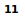

# HV20.05 Image DNA

For this challenge, we got two images of christmas balls. My first intention was trying to compare / combine the images using logical operations like XOR, but none of my experiments succeeded. 

After that, I checked both images using common steganography tools. Firstly, using `binwalk` I noticed that a zip archive was appended to one of the images (`cf505372-330b-4b34-a95b-59fa33db37f8.jpg`). The archive contained a single file (`A`) with the content `00` - does not seem too useful yet.

Moreover, `steghide` was able to extract a hidden image from the second picture (`6bbc452b-6a32-4a72-b74f-07b7ad7b181d.jpg`). The image shows the text `11`:

Finally, I noticed that both images contained a sequence of trailing text:

`CTGTCGCGAGCGGATACATTCAAACAATCCTGGGTACAAAGAATAAAACCTGGGCAATAATTCACCCAAACAAGGAAAGTAGCGAAAAAGTTCCAGAGGCCAAA`

and 

`ATATATAAACCAGTTAATCAATATCTCTATATGCTTATATGTCTCGTCCGTCTACGCACCTAATATAACGTCCATGCGTCACCCCTAGACTAATTACCTCATTC`

After a while, I realized that these sequences could be DNA encoded strings. I wrote a small python [program](./dna.py) to decode them, but it did not produce any printable output. After a while, I tried XORing the bytes after decoding both strings and finally got a flag:

**Flag:** HV20{s4m3s4m3bu7diff3r3nt}
